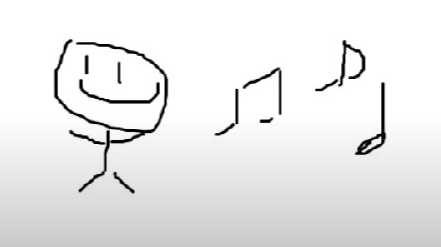
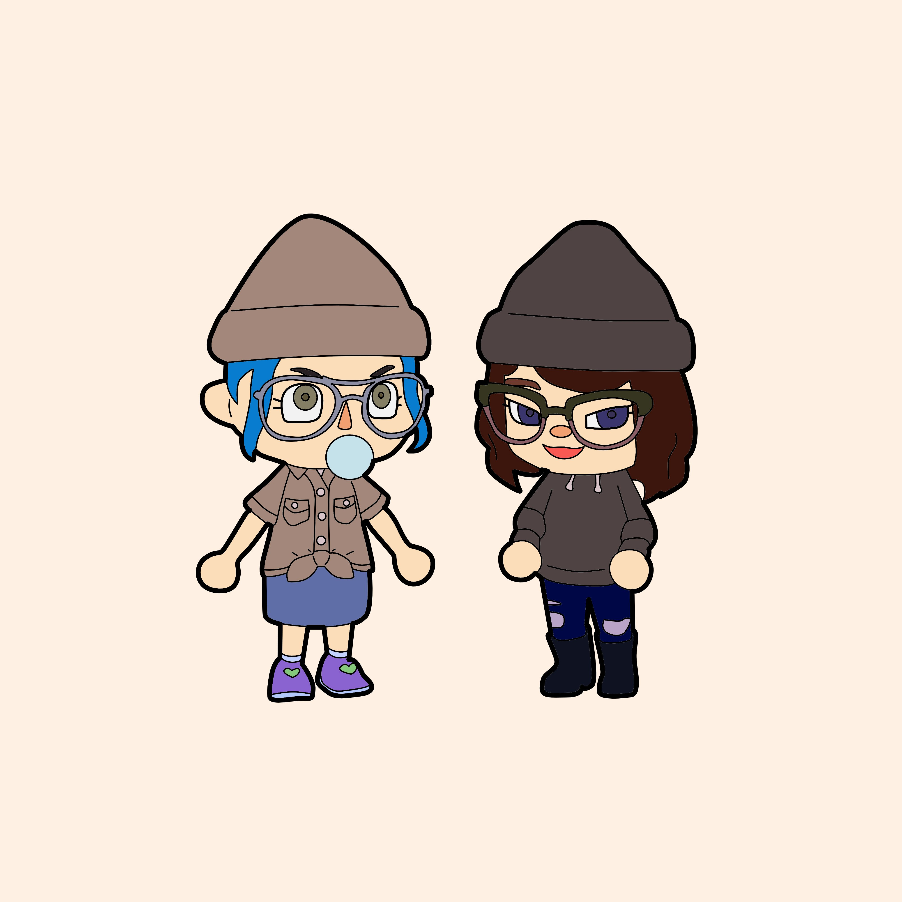
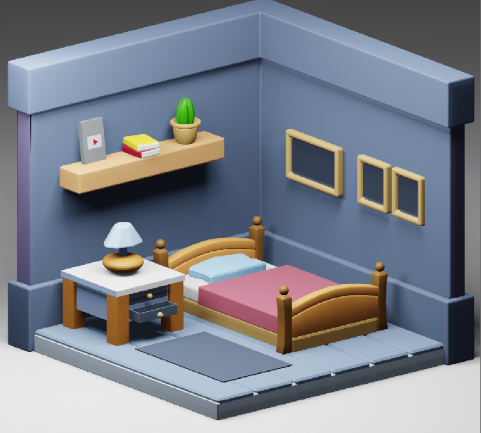

    <h6 class="mt-1 ms-1 mb-4">
        my stickman  
          
        some old animal crossing prints  
          
          
        wonky bedroom in blender  
          
        this isn't art but some old musics i've made for commissions in the past  
        <audio controls class="mb-2">
            <source
            src="../assets/misc/audio/a.mp3"
            type="audio/mpeg"
            />
        </audio> 
        <audio controls class="mb-2">
        <source
            src="../assets/misc/audio/b.mp3"
            type="audio/mpeg"
        />
        </audio> 
        <audio controls class="mb-2">
        <source
            src="../assets/misc/audio/c.mp3"
            type="audio/mpeg"
                    />
        </audio> 
        <audio controls class="mb-2">
        <source
            src="../assets/misc/audio/d.mp3"
            type="audio/mpeg"
                    />
        </audio> 
        <audio controls class="mb-2">
        <source
            src="../assets/misc/audio/e.mp3"
            type="audio/mpeg"
                    />
        </audio> 
    </h6>

