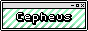

<h5 class="mt-1">cool sites</h5>

    
    
    
    
    
    
    
    

<h5>tools</h5>
<h6 class="mb-2">
    <a href="https://krita.org/en/">krita</a> 
    <a href="https://godotengine.org/">godot</a> 
    <a href="https://www.aseprite.org/">aseprite</a> 
    <a href="https://tinytools.directory/">tinytools</a> 
    <a href="https://codepen.io/">codepen</a> 
    <a href="https://www.cbox.ws/">cbox</a>
</h6>
<h5>really interesting stuff</h5>
<h6 class="mb-2">
    <a href="https://minesweeper.online/">minesweeper</a> 
    <a href="https://noclip.website/">noclip</a> 
    <a href="https://www.joerezendes.com/projects/Woah.css/">Woah.css (epilepsy warning)</a> 
    <a href="https://www.last.fm/home">last.fm</a> 
    <a href="https://entertrained.app/">entertrained</a> 
    <a href="https://boodlebox.neocities.org/award">boodlebox</a> 
    <a href="https://web.badges.world/#">web badges world</a> 
    <a href="https://districts.neocities.org/">one rat</a>
</h6>